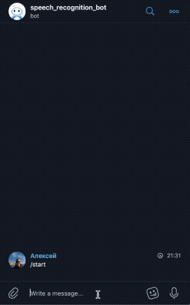

# Разговорные чат-боты для общения в Telegram и Вконтакте с использованием DialogFlow
### Автор проекта: Алексей Свирин, телеграм — [@svirin](https://telegram.me/svirin)
### Цель проекта: создание автономных чат-ботов для мессенджера Телеграм и социальной сети ВКонтакте

Боты отвечают пользователю на сообщения, боты работают на одной бозе фраз, которая загружена в DialogFlow. Ботов можно быстро обучить благодаря дополнительно реализованным функциям. Также в ботах реализована отправка сообщений на отдельного бота в телеграме для ошибок.

  
Примечание. Если вы задете сложный вопрос для бота, то бот ничего не ответит.



# Как установить
### Этап 1. Получить все авторизационные ключи
#### Этап 1.1 Для запуска бота в Телеграме необходимо:
1) Создать бота для пользователй в telegram через [Отца ботов](https://telegram.me/BotFather) и взять токен для авторизации.
2) Создать бота для сервисных сообщений в telegram через [Отца ботов](https://telegram.me/BotFather) и взять токен для авторизации.
3) Узнать свой ID через [специального бота](https://telegram.me/userinfobot).

#### Этап 1.2 Для запуска бота во Вконтакте необходимо:
1) Создать бота для сервисных сообщений в telegram через [Отца ботов](https://telegram.me/BotFather) и взять токен для авторизации.
2) Узнать свой ID через [специального бота](https://telegram.me/userinfobot).
3) [Создать сообщество](https://vk.com/groups?tab=admin) или выбрать из уже созданных.
4) Взять сервисный ключ в разделе "Управление" на вкладке "Работа с API"
5) Разрешить отправку сообщений на вкладке "Сообщения"

#### Этап 1.3 Зарегистрироваться и получить ключ авторизации для Dialogflow:
1) Зарегистрироваться на [сайте](https://dialogflow.com/) сервиса.
2) Создать нового агента — нашего бота в DiaologFlow.
3) На вкладке General установить настройку V2 API и перейти по ссылке в поле 'Service Account' в единую панель управления сервисами Google для получения авторизационного ключа.
4) У вашего сервисного аккаунта необходимо создать ключ и скачать его. Этот ключ авторизации необходимо будет использовать для получения ответов от Dialogflow. 
5) На вкладке IAM у вашего сервисного аккаунта установить роль 'Администратор Dialogflow API'

### Этап 2. Установить переменные окружения
1) telegram_token: токен для основного телеграм-бота;  
2) telegram_token_information_message: токен для сервисного телеграм-бота;
3) chat_id_information_message: id пользователя телеграм, который будет получать сервисные сообщения;  
4) vk_community_token: токен для бота ВКонтакте;
5) project_id: id проекта в dialogflow, который можно взять вкладке 'General' в поле 'Project ID';
6) GOOGLE_APPLICATION_CREDENTIALS: путь для json-файла с ключом авторизации для dialogflow;
7) GOOGLE_CREDENTIALS: данную переменную необходимо использовать только, если вы используете Heroku. В данную переменную необходимо поместить содержимое json-файла авторизации для dialogflow.

### Этап 3. Запустить бота 
#### Пример запуска в консоли
```python
python3 bot-tg.py
```

# Требования
Все требуемые модули указаны в файле requirements.txt  
Для установки запустите команду:
```python
python3 pip install -r requirements.txt
```

# Требования к запуску на Heroku
Для запуска на Heroku необходимо:
1) Файл Procfile. В файле Procfile прописано какой файл нужно запускать на Heroku;
2) Файл Pipfile. В файлах Pipfile и reqirements.txt указаны необходимые модули для работы бота;
3) В разделе Settings добавить новый [Buildpack](https://github.com/elishaterada/heroku-google-application-credentials-buildpack);
4) В раздел Config Vars добавить все переменные окружения.

# Как создать модель вопрос — ответ в dialogflow
#### Cоздание новой темы разговора
1) На вкладке Intents создать Intent. Это будет отдельной темой для бота.
2) Добавить варианты вопросов и ответов.

#### Создать список быстрых ответов
1) На вкладке Small Talk добавить ответы на самые популярные вопросы.

#### Пример автоматизации в папке Example
1) Файл [example phrases.json](https://github.com/asvirin/bots/blob/master/example/example%20phrases.json) — пример файла по которому можно построить темы разговора.
2) Файл [example_create_intent.py](https://github.com/asvirin/bots/blob/master/example/example_create_intent.py) — пример файла для парсинга файла из пункта 1. Функция create_intent — пример кода отправки данных для создания темы разговора. Обратите внимание, что API Dialogflow требует отправка ответов и вопросов в формате list.
##### Аргументы функции create_intent:
— project_id: id проекта, который мы получили в пункте 2.5;  
— display_name: название Intent (темы диалога);  
— training_phrases_parts: фразы на которые будет реагировать бот;  
— message_texts: ответы для бота.  
